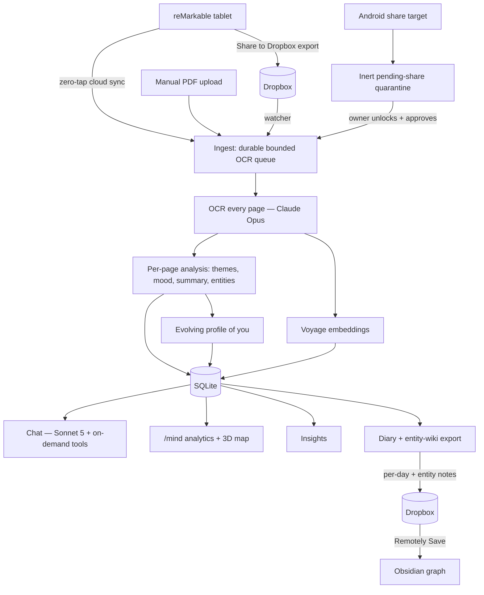

# Remarkabler — architecture & structure map

The whole app on one page: how data flows, how the code is layered, where
every module / table / route / page lives, and what talks to the outside
world. Companion to `SKILL.md` (terse index) and `CLAUDE.md` (deep rules).
Keep this in sync when you add a lib, table, route, or page.

> **Stack:** Next.js 16 (App Router, TypeScript) · better-sqlite3 · Tailwind
> · `@anthropic-ai/sdk` · Voyage embeddings. All data (SQLite `app.db` +
> uploaded PDFs) lives under `DATA_DIR` (`/data` on Railway). Deployed on
> Railway from a **Dockerfile** (Node + a bundled Python `.rm` renderer).

---

## 1. What it does (data flow)



**One sentence:** handwriting → transcription → an AI-reasoned, self-updating
second brain you can chat with, analyse, and browse as an Obsidian graph.

---

## 2. Layers

```
┌───────────────────────────────────────────────────────────────┐
│  UI pages (app/*/page.tsx)         notebooks · chat · mind ·   │
│  React client components           insights · memory · usage  │
└───────────────┬───────────────────────────────────────────────┘
                │ fetch()
┌───────────────▼───────────────────────────────────────────────┐
│  API routes (app/api/**/route.ts)  auth-gated, force-dynamic,  │
│  thin handlers → call into lib     runtime = nodejs            │
└───────────────┬───────────────────────────────────────────────┘
                │
┌───────────────▼───────────────────────────────────────────────┐
│  lib/*.ts  — the actual logic. Split convention:               │
│    • pure module (no DB/IO, unit-tested)  e.g. diaryExport.ts  │
│    • DB-backed sibling                    e.g. diaryExportDb.ts │
└───────────────┬───────────────────────────────────────────────┘
                │
┌───────────────▼───────────────┐   ┌───────────────────────────┐
│  lib/db.ts  (better-sqlite3)  │   │  External services         │
│  20 tables + pages_fts (FTS5) │   │  Anthropic · Voyage ·      │
│  FKs ON, ON DELETE CASCADE    │   │  Dropbox · reMarkable ·    │
│  DATA_DIR/app.db + PDFs       │   │  GitHub · Nominatim ·      │
│                               │   │  OwnTracks · PostHog       │
└───────────────────────────────┘   └───────────────────────────┘
```

---

## 3. Directory tree (annotated)

```
remarkabler/
├── app/
│   ├── layout.tsx, page.tsx        # shell (self-hosted Clear Sans font), home
│   ├── Nav.tsx, AutoLock.tsx, LockScreen.tsx, PostHogProvider.tsx
│   ├── share/route.ts              # PWA Web Share Target
│   ├── notebooks/  chat/  mind/  insights/  memory/  usage/   (page.tsx each)
│   └── api/                        # 46 route handlers (see §5)
├── components/                     # Badge, Button, Card, Section, Stat
├── lib/                            # 34 modules (see §4)
├── test/                           # 39 Vitest files (pure logic + throwaway-SQLite)
├── docs/
│   ├── sessions/                   # dated session logs (decisions + gotchas)
│   ├── obsidian-graph-setup.md     # user phone walkthrough
│   └── reference/                  # vendored Obsidian frameworks (inert)
├── .claude/skills/                 # installed Agent Skills (obsidian-*, defuddle…)
├── docker/                         # rm2pdf wrapper, palette patch, CA hook
├── Dockerfile, railway.json        # Railway build (Node + Python renderer)
├── SKILL.md, AGENTS.md, CLAUDE.md, ARCHITECTURE.md, DESIGN.md, CHANGELOG.md
└── public/                         # manifest.json (PWA), fonts/
```

---

## 4. `lib/` modules by domain

**Core / ingest**
| File | Responsibility |
|---|---|
| `db.ts` | SQLite connection, schema, migrations (FKs ON) |
| `notes.ts` | `createNotebook`, durable `queueNotebookProcessing` + internal OCR worker (embed→profile→analyse), `deleteNotebook`, entry-date carry-forward, discipline sync, maintenance |
| `pendingShares.ts` | Inert public share-target quarantine and persistent abuse/storage bounds; approval is authenticated via `/api/shares` |
| `upload.ts`, `extractText.ts`, `cleanup.ts`, `format.ts` | upload guards, PDF text, orphan cleanup, formatting/TZ |

**AI**
| `claude.ts` | All Anthropic calls: `ocrNotebookPdf`, `chatOverNotes`, `generateInsights`, `buildSelfModel`/`updateSelfModel`, `summarizeDay`, `analyzeEntryContent`, `composeEntityWiki`, `findEntityDuplicates`, axis labels |
| `chatTools.ts` | On-demand chat tools: `search_diary`, `get_entries_by_date`, `top_entities`, `pages_for_entity`, `related_entities`, `get_day_summary`, … |
| `embeddings.ts` | Voyage embed + Float32-BLOB codec + cosine |
| `profile.ts` | the evolving "profile of you" (versioned) |
| `usage.ts` | per-call cost + monthly/daily/total aggregation |

**Entities & graph**
| `mind.ts` | `/mind` analytics (heatmap, themes, sentiment, PCA embedding map), per-entry analysis driver, `getTopEntities` |
| `entityGraph.ts` (pure) | `computeRelatedEntities` — co-occurrence edges |
| `entityMerge.ts` | dedupe: `mergeEntity`, `applyEntityAlias`, `dedupeAllEntities` |
| `entityWiki.ts` | the "life wiki": `refreshEntityWiki` (content-addressed), sweep auto-refresh |

**Export → Obsidian**
| `diaryExport.ts` (pure) + `diaryExportDb.ts` | per-day Markdown, entity `[[wikilinks]]`, YAML frontmatter, entity stub/profile notes |
| `notebookDedup.ts` (pure) + `notebookDedupDb.ts` | duplicate-notebook detection |

**Sources**
| `dropbox.ts` | OAuth ingest + diary auto-export (+ delete/upload helpers) |
| `remarkableCloud.ts`, `remarkableImport.ts`, `remarkableSync.ts`, `remarkableCompare.ts`, `rmRender.ts` | reMarkable-cloud pair/list/download/render/zero-tap-sync/compare |
| `location.ts`, `owntracks.ts` | OwnTracks ingest, stay clustering, reverse-geocode |
| `github.ts` | discipline-repo fetch · `backup.ts` weekly off-site backup |

**Memory & auth**
| `chatMemory.ts` + `chatMemoryBackfill.ts` | durable cross-Clear chat memory (extract→embed→dedup→recall) |
| `auth.ts` + `webauthn.ts` | passkey / passcode lock |

---

## 5. API routes (`app/api/**`)

- **notebooks**: `notebooks`, `notebooks/[id]/pages`, `notebooks/[id]/pdf`, `notebooks/duplicates`
- **chat**: `chat`, `chat/attachment/[id]`, `chat/memories` (+ `[id]`, `process`, `retry/[batchId]`, `backfill-all`)
- **mind**: `mind`, `mind/analyze`, `mind/reanalyze`, `mind/axis-labels`, `mind/reparse-dates`, `mind/merge-entities`, `mind/build-wiki`
- **export**: `export`, `export/diary`, `export/book`, `diary`
- **dropbox**: `connect`, `callback`, `status`, `disconnect`, `export`
- **remarkable**: `connect`, `refresh`, `status`, `disconnect`, `import`, `compare`, `autosync`
- **misc**: `auth`, `insights`, `usage`, `memory`, `embeddings/status`, `backup`, `discipline` (+ `settings`), `location` (+ `settings`), `owntracks`, `settings/models`

---

## 6. UI pages (`app/*`)

| Page | Shows |
|---|---|
| `/notebooks` | upload, notebook list + transcripts, "Possible duplicates" |
| `/chat` | chat over notes (Sonnet 5), voice, attachments |
| `/mind` | heatmap · theme cloud · mood timeline · 3D embedding map · top entities; buttons: analyse, re-parse dates, re-analyse, **merge duplicates**, **build life wiki** |
| `/insights` | AI reflections + weekly-auto toggle |
| `/memory` | chat-memory layer, Dropbox connect/export folder, reMarkable cloud pair/import/auto-sync |
| `/usage` | cost calendar |

---

## 7. Data model (`lib/db.ts`, 20 tables + `pages_fts`)

```
notebooks ─1─┬─* pages ──1─┬─* entry_entities   (person/place/project)
             │             ├─1  entry_analysis   (themes/sentiment/summary)
             │             └─    embedding, entry_date, remarkable_page_*
             └ dropbox_file_id | remarkable_doc_id  (mutually exclusive origin)

pages ──(triggers)── pages_fts (FTS5 full-text)
entry_entities ──(name_norm)── entity_aliases (merges) · entity_wiki (profiles)

chat_messages ─* (archived_at) ── chat_archive_batches ─* chat_memories
daily_summaries · insights · profile (versioned) · api_usage · settings
credentials (passkeys) · chat_attachments
locations · location_points · route_stops · geocode_cache
```

Key invariants: `foreign_keys=ON` (cascades fire); every entity reader keys
on `name_norm`; the `github-discipline` notebook is excluded from /mind,
export, and (toggle-dependent) chat.

---

## 8. External services & the env vars that gate them

| Service | Purpose | Gated by |
|---|---|---|
| **Anthropic** | OCR, chat, insights, analysis, wiki | `ANTHROPIC_API_KEY`; `CLAUDE_MODEL` (Opus), `CHAT_MODEL` (Sonnet 5) |
| **Voyage** | embeddings (semantic search, 3D map) | `VOYAGE_API_KEY` |
| **Dropbox** | auto-ingest + diary/Obsidian export | `DROPBOX_APP_KEY/SECRET`, `APP_BASE_URL` |
| **reMarkable cloud** | zero-tap ingest | one-time pair code (device token in DB) |
| **GitHub** | "discipline" source + weekly backup | `DISCIPLINE_REPO/_TOKEN`, backup repo |
| **Nominatim** | reverse-geocode stays | outbound allowed |
| **OwnTracks** | automatic location | `OWNTRACKS_TOKEN` |
| **PostHog** | anonymous analytics (opt-in) | `NEXT_PUBLIC_POSTHOG_KEY` |
| **Lock** | passkey / passcode gate | `APP_PASSCODE` |

Everything outbound is opt-in per service; with none set, the app is a
fully-local single-user diary.

---

## 9. Background work (`runMaintenanceSweep`, gated ≤ once / 5 min)

profile seed · location distill · weekly insight · embedding backfill · date
backfill · daily summaries · discipline sync · orphan cleanup · weekly backup
· Dropbox ingest · chat-memory compression · reMarkable zero-tap sync ·
**entity-wiki refresh**. Each is internally guarded (interval / in-flight /
backoff) so the sweep is a near-no-op most calls.
```
