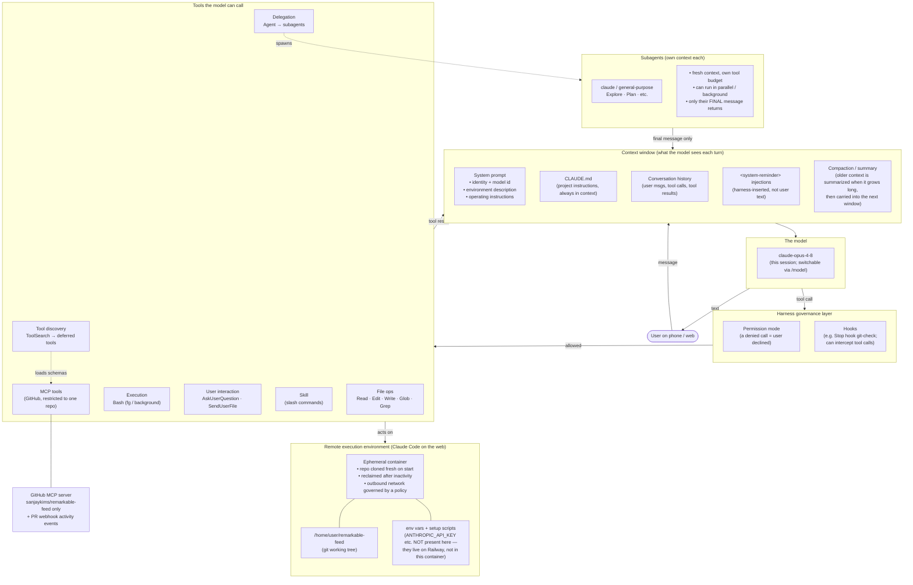

# Claude Code harness — structure of this session

A self-description of the agent harness Claude Code is running inside while
working on this repo, drawn from what is directly observable in the
operating context (the system prompt, the available tools, the injected
`<system-reminder>` messages, and the runtime behaviour seen during the
session). It is **not** a leak of proprietary internals — it's the same
picture any careful reader could assemble from the harness's own signals.

Written 2026-06-05, model `claude-opus-4-8`.

---

## The big picture

> A pre-rendered image of the diagram below is saved alongside this file at
> [`claude-harness.png`](./claude-harness.png) (handy where Mermaid doesn't
> render).

---

## Layer by layer

### 1. The execution environment
- Runs in the cloud, not on the user's machine — a managed, **isolated,
  ephemeral container**.
- The repo is **cloned fresh** when the container starts. Anything not
  committed and pushed is lost when the container is reclaimed (after a
  period of inactivity or when the session ends).
- Outbound network is governed by a **network policy** chosen when the
  environment was created.
- **Secrets like `ANTHROPIC_API_KEY` and `VOYAGE_API_KEY` are NOT in this
  container** — they live on Railway (the deployment host). That's why,
  earlier this session, Claude could not run OCR locally and had to either
  spawn subagents (which use their own model credentials) or have the user
  upload a file directly to chat.

### 2. The context window
Everything the model "sees" on a given turn:
- **System prompt** — identity, the configured model id, the environment
  description, and the operating instructions (including the GitHub rules
  and the branch/commit conventions used all session).
- **`CLAUDE.md`** — the project's own instructions, always present, and
  treated as overriding defaults.
- **Conversation history** — prior user messages, the model's tool calls,
  and the tool results.
- **`<system-reminder>` injections** — inserted by the harness, not the
  user. Examples seen this session: the available-skills list, the
  deferred-tool announcements, and notices that a file was edited.
- **Compaction** — when the conversation grows long, older context is
  summarized and carried into the next context window, so work continues
  without the model having to wrap up early.

### 3. The model
- This session: **`claude-opus-4-8`** (switched via `/model`). Earlier the
  session ran under a different configured id. The model is swappable
  without restarting the harness.

### 4. Tools
Grouped by what they do:
- **File ops** — `Read`, `Edit`, `Write`, `Glob`, `Grep`. Preferred over
  shell equivalents (`cat`, `sed`, `find`, `grep`) because they integrate
  with the permission UI and file-link rendering.
- **Execution** — `Bash`, foreground or background. Working directory
  persists between calls; shell state does not.
- **Delegation** — `Agent` spawns subagents (see below).
- **User interaction** — `AskUserQuestion` (structured choices),
  `SendUserFile` (surface a file as a deliverable).
- **Tool discovery** — `ToolSearch` fetches schemas for **deferred tools**
  whose names are known but whose full definitions aren't loaded yet.
- **Skills** — the `Skill` tool runs slash commands (e.g. `/code-review`).
- **MCP tools** — here, the GitHub MCP server, restricted to this one repo.

### 5. Subagents
- Spawned with the `Agent` tool. Each gets a **fresh context** and its own
  tool budget.
- Can run **in parallel and/or in the background** — this session used 4
  agents at once for the OCR Opus-vs-Sonnet comparison and 10 agents for
  the code-review pass.
- Only a subagent's **final message** returns to the parent; the parent
  never sees the subagent's intermediate work.
- Some subagent types are read-only (e.g. `Explore`, `Plan`); others can
  edit. Subagents can themselves use Anthropic models with their own
  credentials, which is why they could run real OCR when the main session
  could not.

### 6. Deferred tools & MCP lifecycle
- Many MCP tools are **deferred**: their names are announced (in
  `<system-reminder>` messages) but their schemas aren't loaded until
  `ToolSearch` fetches them. Until then they can't be called.
- MCP servers **connect and disconnect** mid-session; the harness announces
  both. This session saw the GitHub server drop and reconnect several
  times, and unrelated servers (Supabase, Vercel, etc.) come and go.

### 7. Governance: permissions & hooks
- Every tool call passes through a **permission mode** chosen by the user.
  A denied call means the user declined — the harness signals this back and
  the model must adapt rather than retry verbatim.
- **Hooks** can intercept the agent. This session's `Stop` hook
  (`~/.claude/stop-hook-git-check.sh`) repeatedly checked for uncommitted /
  unpushed changes and surfaced them as feedback — which is what prompted
  several of the commit-and-push steps.

### 8. GitHub integration
- All GitHub work goes through the **GitHub MCP server**, restricted to
  `sanjaykims/remarkable-feed`. No `gh` CLI, no direct API.
- The harness can subscribe to **PR activity events** (comments, CI,
  reviews) which arrive as `<github-webhook-activity>` messages — though
  this session created and merged PRs directly rather than watching them.

---

## How a single turn flows

1. The user sends a message (from phone or web).
2. The harness assembles the context window (system prompt + CLAUDE.md +
   history + any reminders, compacted if long) and hands it to the model.
3. The model decides to either reply with text or call one or more tools.
4. Tool calls pass through the permission/hook layer; allowed ones execute
   against the container (or spawn subagents, or hit the GitHub MCP server).
5. Tool results return into the context; the loop repeats until the model
   produces a final text reply.
6. Anything meant to persist beyond the container's life must be
   **committed and pushed** — which is the discipline this whole session
   followed (branch → commit → push → PR → merge).
